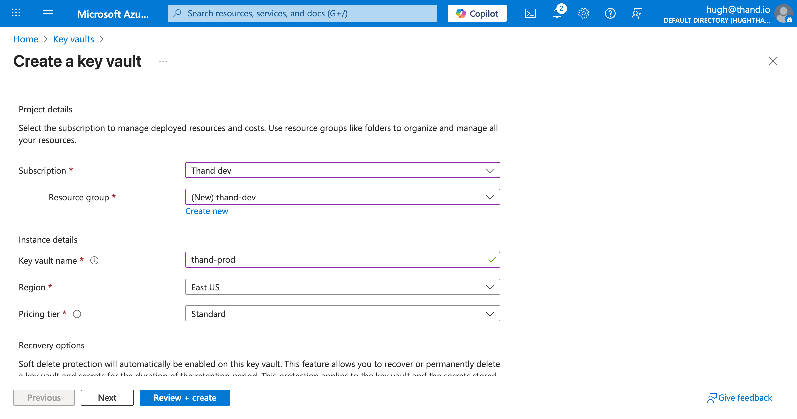
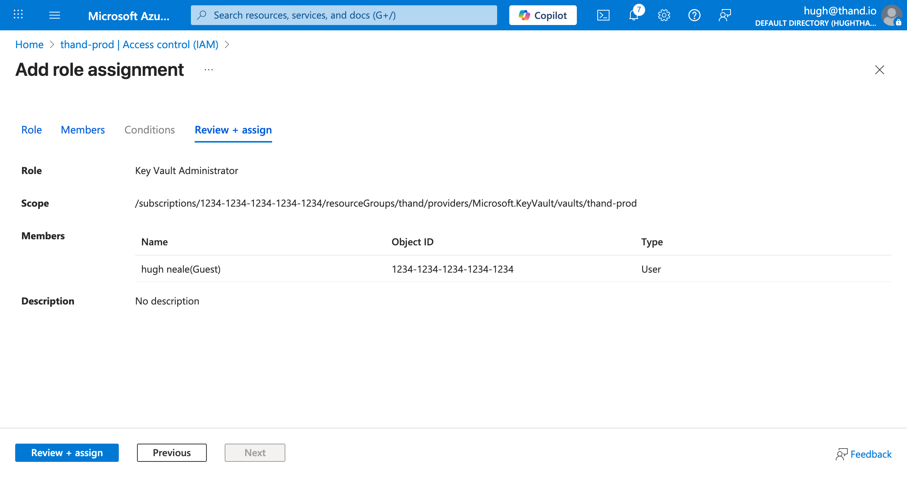
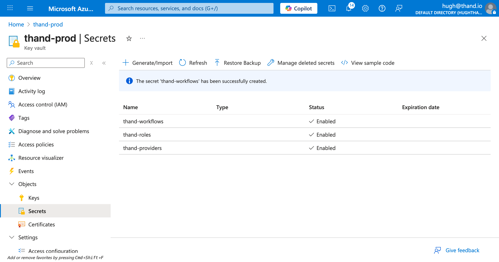
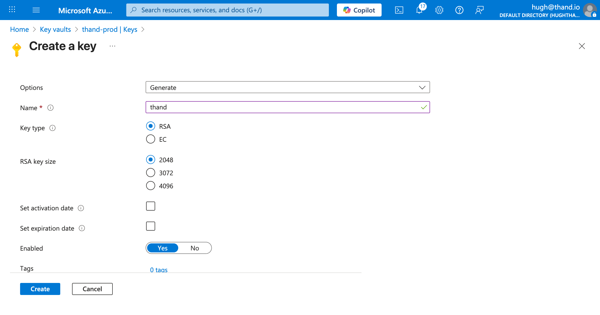
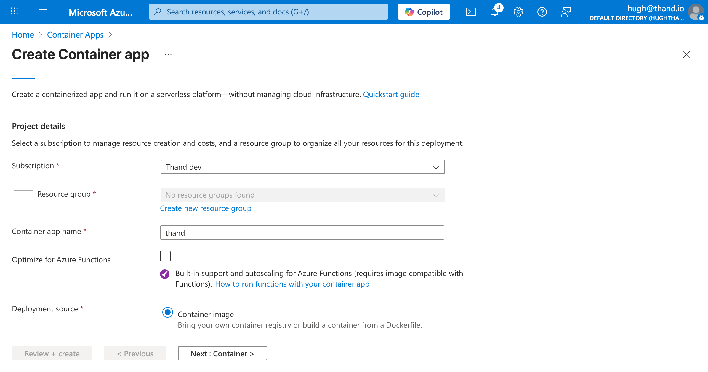
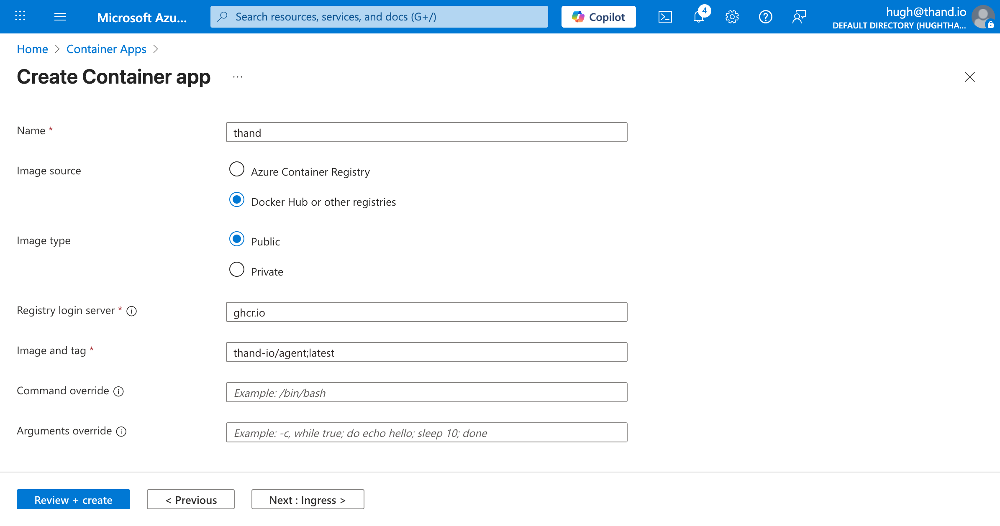
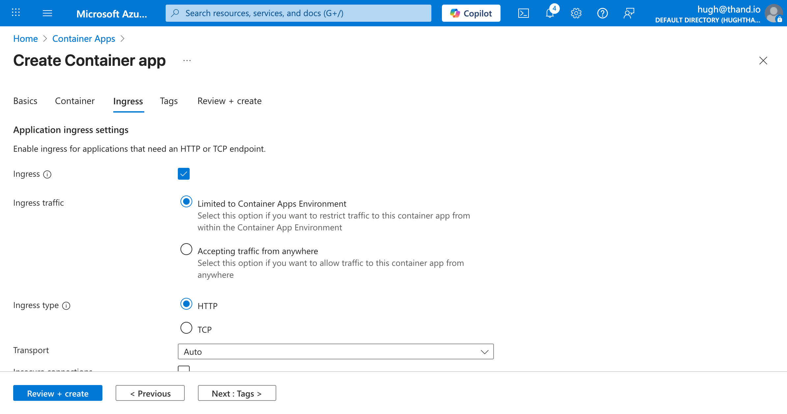
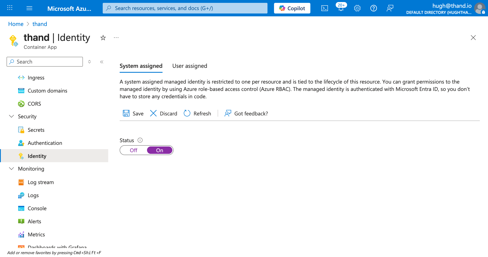
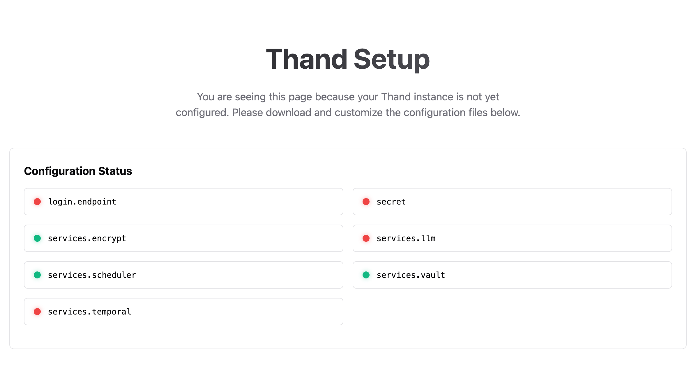

# App Runner Setup
{: .no_toc }

Complete guide to deploying Thand Agent on Azure Container Apps with IAM integration.
{: .fs-6 .fw-300 }

## Table of contents
{: .no_toc .text-delta }

## Prerequisites

- An [Azure account](https://azure.microsoft.com/en-us/free/) with sufficient permissions to create resources.
- An Azure subscription. You can check your subscription ID in the Azure Portal.


### Enabling Vault (Azure Key Vault)

Many of the providers supported by Thand that require API keys or secrets can be configured to use Azure Key Vault to store and retrieve these secrets securely.

This can either be done by configuring the provider to use Key Vault directly, or by configuring Thand to use Key Vault as its secret backend.

In this example, we will configure Thand to use Key Vault as its secret backend. We will create three secrets for our roles, providers, and workflows.

A default provider for Azure using the managed identity attached to the Container App would look something like this:

{: .note}
When storing secrets in Azure Key Vault, the configuration must be in JSON format. AWS Secrets Manager supports both YAML and JSON formats.

```json
{
  "providers": {
    "azure": {
      "name": "Azure Default",
      "description": "Default Azure provider using managed identity",
      "provider": "azure",
      "enabled": true,
      "config": {
        "subscription_id": "your-subscription-id",
        "region": "eastus"
      }
    }
  }
}
```

Create a Key Vault:

- Navigate to the [Azure Portal](https://portal.azure.com/) and search for "Key vaults".
- Click on "Create".
- Select your subscription and resource group.
- Enter a unique name (thand-prod) for your Key Vault.
- Select your region.
- Choose your pricing tier (Standard is sufficient for most use cases).
- Click "Review + create", then "Create".



Configure your access to the Key Vault. By default Azure does not automatically grant your user (principal) access to the Key Vault - even if you created it. You need to explicitly assign access as a Key Vault Administrator:

- In your Key Vault, go to "Access control (IAM)" under the left hand menu.
- Click Add, and select "Add role assignment".
- Search for "Key Vault Administrator" under the roles and ensure its selected. Click Next.
- Select your user/principal under Members and click Next.
- Review and click "Assign".



Create the secrets:

- In your Key Vault, go to "Secrets" under Objects.
- Click on "Generate/Import".
- Select "Manual" as the upload option.
- Name: `thand-providers`
- Value: Provide your entire [provider](../../configuration/providers/) configuration in YAML or JSON format.
- Click "Create".



Repeat the above steps to create two more secrets:
- `thand-roles` - containing your [roles configuration](../../configuration/roles/)
- `thand-workflows` - containing your [workflows configuration](../../configuration/workflows/)

Documentation for configuring providers, roles and workflows can be found in the [Configuration](../../configuration/) section.

You might also need to store other secrets depending on your provider configurations. Or other environment specific secrets you want to manage via Key Vault. Unfortunately, you will need to create a secret per environment variable.

Otherwise, you can provide your configuration via a mounted volume or other methods as described in the [Configuration](../../configuration/) section.

### Encryption Key Setup

To ensure that sensitive data stored by the Thand Agent is secure, we need to set up an encryption key in Azure Key Vault.

To create a new encryption key:



### Deploying Thand Agent on Azure Container Apps

Head over to container apps in the Azure portal and create a new Container App.

Fill in the required fields such as subscription, resource group, and container app name.

* Deployment Name: thand
* Deployment Source: Container image


Click Next to go to the Container settings.

* Name: thand
* Image type: Public
* Registry login server: ghcr.io
* Image and tag: thand-io/agent;latest



Next, we need to configure the ingress settings. By default for this example, we will enable ingress and allow unauthenticated access. Adjust these settings as per your security requirements.

We recommend using Microsoft Entra Identity (formerly Azure AD) for proxy aware identity authentication and authorization.

* Ingress: Enabled
* Ingress traffic: Accepting traffic from anywhere



Click create. We need to configure the secrets and environment variables post creation.

When you're app has finished deploying, navigate to your Container App and go to the "Overview" tab. Under "Application Url" click and visit the link you should be presented with the following:



Keep this application URL handy as well need it for configuring the environment variables.

## Configure Thand App Runner Service

Now we've deployed all the necessary Azure resources, we need to configure our Thand Agent App Runner service to make use of them.

### Managed Identity Configuration

To allow the Thand Agent to access the Key Vault, we need to assign the appropriate permissions to the Container App's managed identity.


Once Managed Identity is enabled for your Container App. You now have your Object or Principal ID. Click Azure role assignments and follow these steps:

* Add role assignment
* Scopre: Select your Key Vault
* Subscription: Your subscription
* Resource group: Your resource group
* Role: Key Vault Reader



### Setting Environment Variables

- Navigate to the Azure Container Apps console. [Azure Container Apps Console](https://portal.azure.com/#blade/HubsExtension/BrowseResource/resourceType/Microsoft.App%2FcontainerApps)
- Select your Thand Agent container app.
- Click on "Application" -> "Containers" tab.
- Click "Environment variables" tab.

Next add the following:

| Variable Name                     | Description                                                                                   | Example Value                                      |
|----------------------------------|-----------------------------------------------------------------------------------------------|----------------------------------------------------|
| `THAND_ENVIRONMENT_CONFIG_VAULT_URL` | Your KMS key ARN or alias                                                                | `https://thand-prod.vault.azure.net/`        |
| `THAND_ENVIRONMENT_CONFIG_KEY_NAME` | The name of the KMS key used to encrypt sensitive data at rest in the Thand Agent database. | `thand`                              |
| `THAND_SECRET` | A value used to encrypt sensitive data at rest in the Thand Agent database. Use a strong, random string. | `your-strong-random-string`                        |
| `THAND_ENVIRONMENT_CONFIG_REGION` | Your Azure region                                                                               | `eastus`                                       |
| `THAND_LOGIN_ENDPOINT`            | The endpoint for your deployed Thand Agent                                                   | `https://thand.livelysand-271937.eastus.azurecontainerapps.io`      |
| `THAND_PROVIDERS_VAULT`           | The name of the Secrets Manager secret containing your providers configuration               | `thand-providers`                                  |
| `THAND_ROLES_VAULT`               | The name of the Secrets Manager secret containing your roles configuration                   | `thand-roles`                                     |
| `THAND_WORKFLOWS_VAULT`           | The name of the Secrets Manager secret containing your workflows configuration               | `thand-workflows`                                 |
| `THAND_ENVIRONMENT_PLATFORM`     | The environment platform for the Thand Agent                                                 | `azure`                                             |

Your final environment variables should look something like this:



Click *Save as new revision* to apply the changes.
